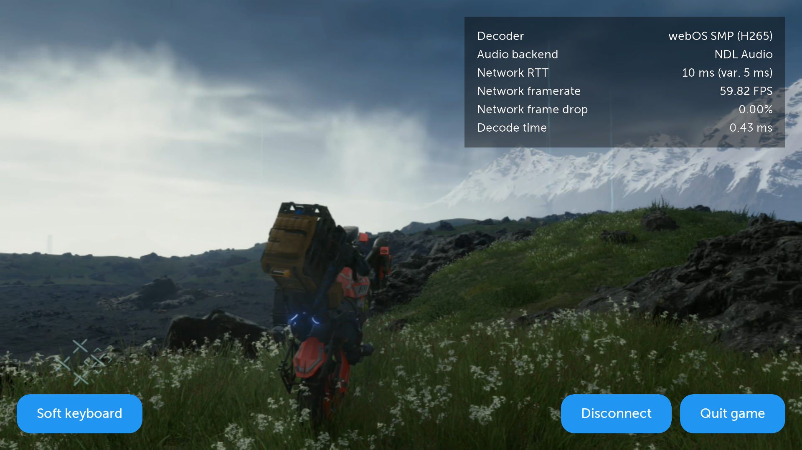

# Introduction

Use our tools and guides to develop homebrew apps, games and mods.

---

With official SDKs and tools provided by LG, you can develop web-based apps.
While many content-based apps can be built this way, it has many limitations.

In addition to official tools, we have our unofficial toolchains and documentations, you can develop high-performance
native apps, and utilize the full potential of webOS.

## Showcases

### Kodi

[Kodi](https://kodi.tv/) has been ported to webOS by the community. It utilizes native media APIs to provide
hardware-accelerated video
playback.

### Moonlight

[Moonlight](https://github.com/mariotaku/moonlight-tv) is one of the first native homebrew apps built for webOS. With
low-level media APIs like `libndl-media`,
it provides low-latency game streaming from a PC. It also uses SDL2 for rendering and input handling.

* Next
    * [Environment Setup](/develop/guides/env-setup)