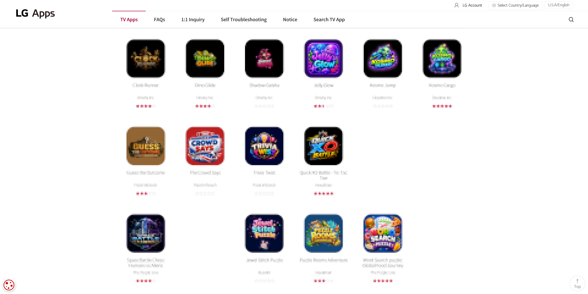

# Guidelines

Why the [rules](/develop/guides/publishing/rules) read the way they do, and what each one
looks like against a real submission.

{{> stub }}

Nothing here refuses a submission on its own. The rules page is the list you are measured
against. This page is what a maintainer is thinking about while they read it, written down
so the judgement is not a private one.

## No AI Slop {#no-ai-slop}

The disclosure is a set of checkboxes on the pull request template, running from no AI use
at all down to *produced primarily by AI without meaningful human development or review*.
That last box is the rule, in your own words. Tick it honestly and the answer is no.

Where the line falls is the part people argue about, so judge the submission rather than the
tooling:

* **One app, not one of a dozen.** A web page in a wrapper, reskinned per site, is the shape
  that fills a storefront with nothing. LG's own
  [Content Store](https://us.lgappstv.com/main/tvapp) is the cautionary version, and it is
  what this repository exists not to be.
* **It has been run on a TV.** Not the browser, not the emulator alone. Say which model and
  which webOS release you tested on.
* **The icon and the description are yours.** A stock logo and a paragraph of generated
  blurb read as slop even when the code underneath is fine.
* **You can answer for it.** A maintainer will ask why something is written the way it is.
  "The model wrote it" is the failing answer.

*The games tab of the Content Store. Mechanics, icons, promotional art — slop all the way
down. Names are blurred and the apps that were not examples are gone, hence the gaps.*

Do you want Homebrew Channel filled with these? It is small and checked by hand, and that is
the whole of its worth next to the Content Store. Nobody wants to scroll past forty of yours
to reach one that works.

## No Piracy {#no-piracy}

There is the takedown risk that comes with pointing at other people's content, and these
apps do not last: the service behind one goes down without warning and the listing is left
pointing at something broken, which is already grounds for removal.

The app itself is not the problem. What it hands the viewer is.

| Kind of app | Acceptable | Not acceptable |
| --- | --- | --- |
| Game emulator | The emulator on its own | Shipping copyrighted ROMs with it, or fetching them for the viewer |
| Media player | Playing what the viewer already has, or a library that is public domain or openly licensed | A library of anything else, whether it ships with the app or the app fetches it |
| Client for a service | Crunchyroll, YouTube and the like, signed in with the viewer's own account | Anything that gets around the account, or around the DRM |

## Respect the Hardware {#respect-the-hardware}

Running on a TV is not the same as being for one. A Minecraft server on a rooted set is a
good afternoon and a bad listing. Ask what somebody does with your app from a sofa with a
remote in hand, and whether that needs a TV at all.

A TV is also expensive, and the rest of this rule is about not breaking it. That is mostly
what your app does outside its own sandbox. An app that stays inside one is hard to do
lasting damage with, because the [jailer](/develop/guides/vocabulary#jailer) never mounted
the things worth breaking. A rooted app has no such floor, and what follows is about that
code: a startup script, or anything your app does once the user has rooted the TV.

* **Never write to the system partitions.** They are signed squashfs images, and a failed
  write bricks the TV for good. Apply your change at run time and leave the original alone,
  see [System Mods](/develop/guides/system-mods) and the warning in
  [Filesystem](/develop/guides/filesystem).
* **A startup script runs again on every boot, including the bad ones.** One that hangs or
  crashes the TV repeats until somebody intervenes, and enough failed boots can cost the
  user Developer Mode. Read [Startup Script](/develop/guides/startup-script) before you ship
  one, and treat the failsafe mode described there as a backstop rather than a plan.
* **Symlink the script, do not copy it.** A copy keeps running after the user removes your
  app, and they have no obvious way to find out why.
* **Check before you act, and stop if the target is missing.** Your script cannot assume the
  state it last left, and a file that exists on one webOS release may not on the next.
* **Say what you did.** Nothing captures your output on its own, so redirect it to a file
  under `/var/lib/webosbrew/`. When a user reports that their TV now boots strangely, that
  log is what makes it fixable.

Test removal as carefully as installation. webOS takes the app container away and runs
nothing of yours on the way out — there is no uninstall hook, so there is no moment where
cleanup code of yours could run. Whatever you put anywhere else is simply still there
afterwards.

That is the whole reason a startup script is a symlink rather than a copy. The symlink breaks
when the container goes and the script stops running by itself. A copy keeps running for
somebody who now has no app to connect it to, and no obvious way to find out what is doing
it. Anything else you leave behind, a log under `/var/lib/webosbrew/` included, should be
small enough and named clearly enough that a person can recognise it and delete it by hand.

## Honour the Licence {#honour-the-licence}

The `pool` field in your package file is where you declare which side you are on, and it is
checked:

| `pool` | Means | What the repository requires |
| --- | --- | --- |
| `main` | Open source | `sourceUrl` must point at a publicly reachable repository, and that repository should carry a licence |
| `non-free` | May be closed source | No source required, unless you ported copyleft code |

A missing or unreachable `sourceUrl` on a `main` package fails the pull request outright. An
unidentifiable licence is only a warning, because vendored code, forks and custom terms all
need a human to judge them.

`non-free` is for your own closed source app. It is not a way out of a licence you already
took code under. Port a GPL project and mark it `non-free` and you have avoided nothing —
you have written down, in the package file, that you are not publishing source you are
obliged to publish. That is a refusal.

See [How to Submit](/develop/guides/publishing/how-to) for the rest of the package file.

* Previous
    * [Rules](/develop/guides/publishing/rules)
* Next
    * [How to Submit](/develop/guides/publishing/how-to)
