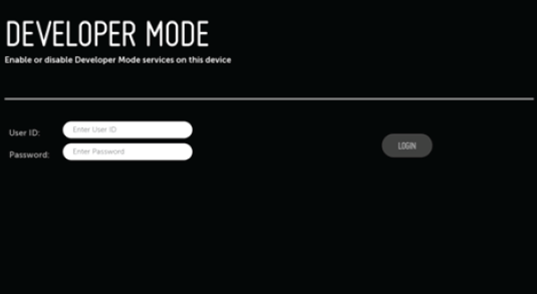
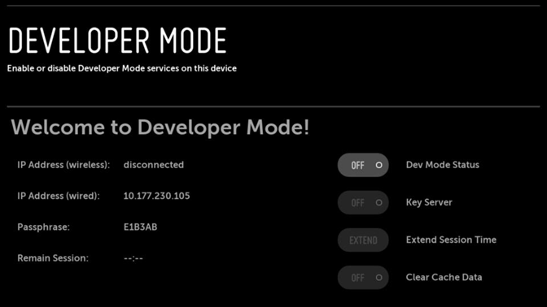

# Dev Mode

Use officially supported development mode to install homebrew apps and games.

> ### Before You Begin
>
> Please read every step carefully before proceeding.
>
> #### <i class="bi bi-info-circle me-2"></i>What's Needed
> 1. A computer or smartphone

## Get Started

### Get a Developer Account

1. Visit [webOS TV Developer](https://webostv.developer.lge.com/), select "Sign In"
   
2. You will be redirected to LG Account login page. If you don't have an account, select "CREATE ACCOUNT"
   
3. You'll see a pop-up window. Select country and click "CONFIRM"
   
4. Accept terms & conditions and click "AGREE"
   
5. Input your email address and password, check required checkboxes, and click "CONFIRM"
   
6. You'll receive an email to verify your email address. Click the link in the email to verify your email
   address. 
7. Go back to the LG Account login page and login with your email and password
   

Now you'll be able to use this account to log in to Developer Mode app on your TV.

### Install Developer Mode App

1. Open LG Content Store, search for "Developer Mode"
   
2. Select "Developer Mode" app
   
3. Click "Install" to download and install the app
   

### Enable Developer Mode

1. Launch Developer Mode app
2. Login to Developer Mode app with developer account
   
3. Enable Developer Mode and wait for TV to restart
   

### Prepare for Device Setup

1. Launch Developer Mode app again
2. Ensure "Dev Mode Status" is ON
3. Enable Key Server <i class="bi bi-question-circle-fill" data-bs-toggle="tooltip"
   data-bs-title="Key Server is used when you add TV to your computer"></i>

## Troubleshooting

#### Everytime I restart the TV, "Key Server" is disabled

Key server only needs to be enabled when you add the TV to ares-cli or webOS Dev Manager.

#### Key Server is enabled, but I can't add the TV to webOS Dev Manager

Make sure your TV and computer are on the same network.
If you're able to ping the TV from your computer, then you may run into some issues caused by
EULA acceptance. Try to do the
following [(source)](https://github.com/webosbrew/dev-manager-desktop/issues/163#issuecomment-1850806539):

1. Navigate on your TV to: settings/general/user agreements
2. Uncheck each user agreement option which forces the TV to reboot. After which, any app you open will
   force you to re-check the EULA.
3. Then open the developer mode app and click "Key Server".

## Important Notes

* Developer Mode has a time limit of 1000 hours. Once expired, apps installed via Developer Mode will be removed.
  You can reset the timer in the Developer Mode app.
* You can only log in to one TV at a time with the same developer account. If you log in to another TV, the previous
  TV will be logged out, disabling Developer Mode.
* When you add the TV to webOS Dev Manager, the IP you use may change. To prevent this, you can set a static IP for
  your TV.
    