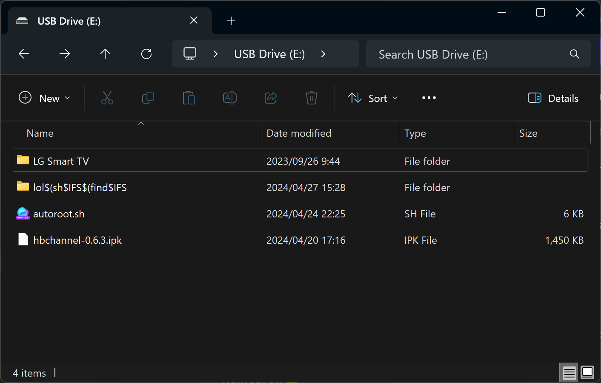

# DejaVuln

A simplified guide of [dejavuln-autoroot](https://github.com/throwaway96/dejavuln-autoroot),
by [throwaway96](https://github.com/throwaway96).

> [!WARNING]
> LG has started rolling out patched firmware. Do not update your
> firmware if you want to be able to root your TV.

> ### Before You Begin
>
> Please read every step carefully before proceeding.
>
> #### :bi-tv: Target
> TV running webOS **3.5 ~ 8.x**
> (visit [CanI.RootMy.TV](https://cani.rootmy.tv/) to find out if your TV is supported)
>
> #### :bi-info-circle: What's Needed
> 1. A computer
> 2. A USB thumb drive (16MB or larger)

## Prepare USB Drive

### Format USB Drive

1. Insert the USB drive into your computer.
2. Format the USB drive to FAT32 or NTFS. **Do not use exFAT**.

### Download DejaVuln

1. Open [latest the release of DejaVuln](https://github.com/throwaway96/dejavuln-autoroot/releases/latest).
2. Download `dejavuln-autoroot-*.zip` from the assets section. **Do not download the source code**.
3. Extract the contents of the zip file **to the root** of the USB drive. It should look like this:
   

## Begin Rooting

### Prepare TV

1. Remove any other USB drives from your TV.
2. Make sure LG Developer Mode app is not installed on your TV. You _MUST_ uninstall it if it is installed.
3. Insert the USB drive with DejaVuln exploit into your TV.

### Run DejaVuln

1. Open the Music app.
2. Navigate to the USB drive.
3. Browse to `lol$(sh$IFS$(find$IFS/tmp`.
4. Try to play the MP3 file (`usb$IFS-maxdepth${IFS}3$IFS-name${IFS}autoroot.sh)).mp3`).
5. After the pop-up messages tell you rooting is complete, eject the USB drive.

## Troubleshooting

### I'm seeing "This file cannot be played" error

This is not an error. The `.mp3` file is not a real audio file.
